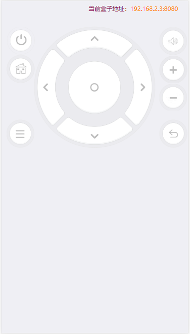

# phicomm tv control
skynet simpleweb for control phicomm tv

斐讯电视盒子 T1/N1 的遥控器网页版本，省去了安装 APP 的麻烦。可以把这个服务架设在局域网的 NAS 上。

原理见： https://bbs.hassbian.com/thread-3745-1-1.html 和 http://www.lenashane.com/article/20181106-1205.html


# Test run in Docker

可以去这里下载最新的 https://hub.docker.com/r/hanxi/phicomm-tv-ctrl

假设斐讯盒子的IP为 `192.168.2.3`

```
docker pull hanxi/phicomm-tv-ctrl
docker run -p 8990:80 -e TV_HOST=192.168.2.3:8080 hanxi/phicomm-tv-ctrl
```

然后浏览器访问 http://localhost:8990

正式环境建议采用 `docker-compose` 或者 群晖自带的 Docker 面板配置。

# 引用

- 前端界面和部分代码来自这里 [kingthy/TVRemoteIME](https://github.com/kingthy/TVRemoteIME)
- 后端采用 [cloudwu/skynet](https://github.com/cloudwu/skynet)

# 截图


